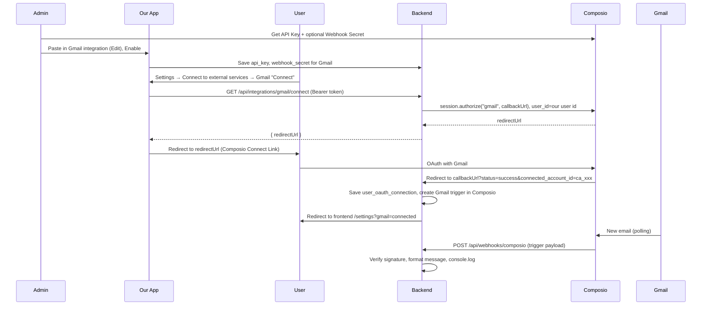

# Composio Gmail Integration Plan

## 1. What you do in Composio (manual steps)

1. **Sign up and get API key**
   - Go to [Composio](https://composio.dev) and sign up / log in.
   - Open the [Composio Developers / Dashboard](https://app.composio.dev) (or **Developers** / **API Keys** in the app).
   - Create or copy your **API Key**. This is the only credential needed for default Gmail (no Google Client ID/Secret).
2. **Configure webhook URL (where Composio will send new-email events)**
   - Option A (recommended): In [Composio Platform](https://platform.composio.dev) go to **Settings** → **Webhook** (or **Settings** → **Webhook URL**). Set the URL to your backend's public webhook route, e.g. `https://your-backend-domain.com/api/webhooks/composio`. Save.
   - Option B: Register the webhook via Composio's API (see "Backend – webhook registration" below). The response will include a **webhook secret**; store it as in "Where to store in our app".
3. **Create webhook subscription for trigger events**
   - In the same Composio dashboard (or via API), ensure the webhook is subscribed to **`composio.trigger.message`** so you receive Gmail trigger events. If you use the dashboard, enable "Trigger events" or equivalent. If you use the API, the subscription payload includes `"enabled_events": ["composio.trigger.message"]`.
4. **No Google Cloud setup**
   - Do **not** create a Google OAuth client. Composio's default Gmail auth uses Composio's managed OAuth app ("Composio" will appear on the consent screen).

---

## 2. What to copy from Composio and where to store it in our app

| What to copy | Where it is in Composio | Where to store in our app |
|--------------|-------------------------|----------------------------|
| **API Key** | Developers / API Keys in Composio app | Admin UI: **Administration** → **Integrations** → find **Gmail** → **Add** or **Edit** → paste in **Composio API Key** field (see "Admin UI" below). Persisted in DB column `integrations.api_key` for the Gmail row. |
| **Webhook secret** (optional but recommended) | Returned once when you create a webhook subscription (API or dashboard); or rotate secret in dashboard to get a new one | Same admin integration form: **Webhook secret** field. Persisted in `integrations.webhook_secret` for the Gmail row. Used by the backend to verify Composio webhook signatures. |

**Flow for you:** Copy API Key from Composio → In our app, Administration → Integrations → Gmail → Edit → paste **Composio API Key** → (optional) paste **Webhook secret** if you have it → Enable integration → Save. No Client ID / Client Secret for Gmail when using Composio.

---

## 3. Architecture and data flow

---

## 4. Project changes (this repo)

### 4.1 Database ([backend/src/db.ts](backend/src/db.ts))

- **integrations**
  - Add nullable columns: `api_key TEXT`, `webhook_secret TEXT`.
  - Keep existing `client_id`, `client_secret`, `redirect_uri` for non-Composio integrations.
- **user_oauth_connections**
  - Add nullable column: `composio_connected_account_id VARCHAR(255)`.
- **hasCredentials logic**
  - Treat an integration as having credentials if either `(client_id IS NOT NULL AND client_id != '')` OR `(api_key IS NOT NULL AND api_key != '')`, so Gmail can be enabled with only `api_key` set.

### 4.2 Backend ([backend/src/server.ts](backend/src/server.ts))

- **Composio SDK**
  - Add dependency: `@composio/core` (or the correct Composio Node/TS package per their docs). Use it only on the backend for `session.authorize()` and `triggers.create()`.
- **Connect link (user clicks "Connect" on Gmail tile)**
  - New authenticated route, e.g. `GET /api/integrations/gmail/connect` (or `POST`).
  - Load Gmail integration row; require `enabled` and non-empty `api_key`.
  - Create Composio client with that `api_key`; call `session.authorize("gmail", { callbackUrl })` with:
    - `user_id`: string version of our JWT user id (e.g. `String(payload.id)`).
    - `callbackUrl`: backend callback URL, e.g. `https://<backend-host>/api/integrations/gmail/callback?user_id=<id>` (use env or config for base URL).
  - Return JSON `{ redirectUrl: connectionRequest.redirectUrl }`.
- **OAuth callback (Composio redirects here after user authorizes Gmail)**
  - New route: `GET /api/integrations/gmail/callback?user_id=...&status=...&connected_account_id=...` (Composio adds `status`, `connected_account_id`).
  - Verify `user_id` matches a valid user (and optionally that state is consistent).
  - Insert or update `user_oauth_connections`: `user_id`, `integration_id` (Gmail), `composio_connected_account_id` from query. No need to store tokens; Composio holds them.
  - Using the same Composio client (Gmail `api_key`), call Composio to create a trigger: slug `GMAIL_NEW_GMAIL_MESSAGE`, `user_id` = same string user id, no extra config (or minimal config if required by API). This ties the connected account to new-email events.
  - Redirect the user to the frontend Settings page with success, e.g. `frontendBaseUrl/settings?gmail=connected` (frontend base URL from env or config).
- **Webhook (Composio sends new-email events here)**
  - New route: `POST /api/webhooks/composio` (no JWT; Composio calls this).
  - Read raw body (required for signature verification). Get `webhook_secret` from Gmail integration row (or single app-level config).
  - Verify Composio webhook signature using headers `webhook-id`, `webhook-timestamp`, `webhook-signature` and the raw body (Composio docs / SDK). If verification fails, return 401.
  - Parse JSON; if `type === 'composio.trigger.message'` and `metadata.trigger_slug === 'GMAIL_NEW_GMAIL_MESSAGE'`, format the `data` (e.g. subject, snippet, from, id) into a short message and `console.log` it. Optionally log full payload for debugging.
  - Always return 200 for valid requests so Composio does not retry.
- **Optional: register webhook with Composio**
  - When admin saves Gmail integration with `api_key`, backend can call Composio's webhook subscription API to register `https://<backend>/api/webhooks/composio` with `enabled_events: ["composio.trigger.message"]`, and store the returned secret in `integrations.webhook_secret`. This replaces manual "Configure webhook URL" in Composio; if you do this, document that the admin only needs to paste the API key and optionally the secret if they already created a subscription manually.

### 4.3 Admin API and UI

- **Backend**
  - **GET /api/admin/integrations**
    - Include `api_key` only as a boolean "hasApiKey" (or omit for security); expose `webhook_secret` only as "hasWebhookSecret" if at all. So the admin list does not leak secrets.
  - **POST /api/admin/integrations** (or existing upsert)
    - Accept optional `apiKey`, `webhookSecret` in body; persist to `integrations.api_key`, `integrations.webhook_secret` for the given `serviceKey`. For Gmail, `hasCredentials` becomes true when `api_key` is set (so admin can Enable without client_id).
  - **hasCredentials**
    - In the query that returns integrations for admin, set `hasCredentials = (client_id IS NOT NULL AND client_id != '') OR (api_key IS NOT NULL AND api_key != '')`.
- **Frontend** ([frontend/src/App.tsx](frontend/src/App.tsx))
  - **Administration → Integrations**
    - For the Gmail row (or for a "Composio" type if you introduce a type later), show an **Edit** form that includes:
      - **Composio API Key** (required for Gmail with Composio).
      - **Webhook secret** (optional): for webhook signature verification.
      - **Enable integration** (existing).
    - You can keep Client ID / Client Secret in the same modal but hide or disable them for Gmail when "use Composio" is implied, or show Composio fields only when `serviceKey === 'gmail'`. No need to create a separate "Composio" integration type for this scope.
  - **Settings → Connect to external services**
    - Gmail tile: when integration is enabled and user is not connected, show **Connect** button. On click, call `GET /api/integrations/gmail/connect` with Bearer token, then set `window.location.href = response.redirectUrl`. After redirect back from Composio, user lands on Settings with `?gmail=connected`; refetch `/api/me/connections` so the tile shows "Connected".
  - **Callback**
    - No frontend route needed; backend callback handles the Composio redirect and redirects the browser to the frontend Settings URL.

### 4.4 Environment / config

- Backend needs:
  - **Backend base URL** (e.g. `https://employee-agent-api.up.railway.app`) for `callbackUrl` and for optional webhook registration.
  - **Frontend base URL** (e.g. `https://your-app.up.railway.app`) for redirect after callback.
- These can be env vars (e.g. `BACKEND_URL`, `FRONTEND_URL`) or existing config; use them when building `callbackUrl` and the post-callback redirect.

### 4.5 Gmail in integrations table

- Ensure a row exists for Gmail (e.g. `service_key = 'gmail'`, `display_name = 'Gmail'`, `group_name = 'Communication'`). If your seed or migrations already insert it, no change; otherwise add a one-off insert or seed.

---

## 5. Order of implementation (suggested)

1. **DB**: Add `api_key`, `webhook_secret` to `integrations`, `composio_connected_account_id` to `user_oauth_connections`; update `hasCredentials` logic.
2. **Backend**: Add Composio SDK; implement `/api/integrations/gmail/connect` and `/api/integrations/gmail/callback`; persist connection and create Gmail trigger.
3. **Backend**: Implement `POST /api/webhooks/composio` (verify signature, format and `console.log` Gmail new-email payload).
4. **Admin API**: Accept and store `apiKey` / `webhookSecret`; expose `hasCredentials` based on `api_key` for admin.
5. **Frontend admin**: Add Composio API Key (and optional Webhook secret) to integration Edit modal for Gmail; ensure Gmail can be enabled with only API key.
6. **Frontend Settings**: Gmail tile "Connect" → call connect API and redirect to `redirectUrl`; after return, refetch connections.
7. **Config**: Set `BACKEND_URL` and `FRONTEND_URL` (or equivalents) for callback and redirect.
8. **Manual**: In Composio, set webhook URL to `https://<backend>/api/webhooks/composio` (or register via API) and subscribe to `composio.trigger.message`; copy API Key (and optional webhook secret) into our app's Gmail integration in Administration.

---

## 6. References

- [Composio – Manual authentication](https://docs.composio.dev/docs/authenticating-users/manually-authenticating) (Connect Link, `session.authorize`, `callbackUrl`).
- [Composio – Triggers](https://docs.composio.dev/docs/triggers) (polling for Gmail, webhook delivery).
- [Composio – Subscribing to events](https://docs.composio.dev/docs/setting-up-triggers/subscribing-to-events) (webhook URL, `composio.trigger.message`, payload shape).
- [Composio – Webhook verification](https://docs.composio.dev/docs/webhook-verification) (headers, signature, secret).
- [Composio – Creating triggers](https://docs.composio.dev/docs/setting-up-triggers/creating-triggers) (`GMAIL_NEW_GMAIL_MESSAGE`, `user_id`).
- Gmail trigger slug: `GMAIL_NEW_GMAIL_MESSAGE` (Composio Gmail toolkit).
